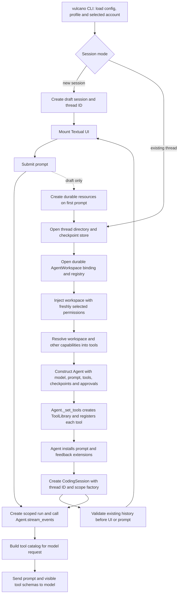

# Vulcano coding interface

Vulcano is the optional Textual interface for a msgFlux coding agent. It uses
the ordinary `Agent` event stream and checkpoint store; the UI does not keep a
separate conversation history.

## Install and start

```bash
uv sync --extra coding
uv run --extra coding vulcano --model openai/gpt-4.1-mini --workspace /path/to/project
uv run --extra coding vulcano --model openai/gpt-4.1-mini --workspace /path/to/project --read-only
```

If the provider key is stored in a separate `.env` file, pass it to `uv run`:

```bash
uv run --env-file /path/to/.env --extra coding vulcano \
  --model openai/gpt-4.1-mini --workspace /path/to/project
```

The first command permits local edits and commands. The second disables Bash
and file mutation tools. Add `--review-edits` to review file tool changes in
interactive sessions; Bash commands are not covered by file-edit reviews.
The command opens the project as a local workspace and stores each conversation
in `~/.msgflux/threads/<thread_id>/`. That directory contains
`checkpoints.sqlite3`, `metadata.json`, and, when edit review is enabled,
`approvals.sqlite3`. A new interactive session starts as a draft: it receives a
thread ID, but creates no thread directory, model, or workspace until the first
prompt is sent. Opening an existing thread validates its checkpoint history
before replacing the current session. The current thread ID appears in the
left sidebar. Pass `--thread THREAD_ID` to continue that thread. `--state-dir`
changes the root. Threads from the earlier shared
`~/.msgflux/coding/checkpoints.sqlite3` remain readable through `--thread`; they
are not moved automatically.

## Configure a profile and account

Vulcano reads `~/.msgflux/config.toml`. Profiles are named by the user and
select logical capabilities. For example:

```toml
default_model = "openai/gpt-5"
default_profile = "lite"
reasoning_effort = "medium"

[active_accounts]
openai = "work"

[profiles.lite.tools]
active = ["workspace"]

[profiles.research.tools]
active = ["workspace", "agents"]

[agents.explorer]
description = "Explore the project and report findings"
models = ["openai/gpt-5"]
```

The `lite` profile grants the workspace tool group. `research` also makes the
configured explorer agent available through `AgentTool`. Multiple model paths
under `agents.explorer.models` create a `ModelGateway`; the main agent can
choose one when calling it, and automatic gateway fallback is disabled.
`default_model` is used unless `--model` or a profile's `model` overrides it.
`reasoning_effort` can also be set in a profile or overridden with
`--reasoning-effort`; an explicitly unsupported setting fails at startup. Without a setting, Vulcano
uses `medium` on models whose API accepts reasoning effort.

Add an API key account using an environment variable or the hidden prompt:

```bash
uv run --extra coding vulcano account add openai work --key-env OPENAI_WORK_API_KEY
uv run --extra coding vulcano account list openai
uv run --extra coding vulcano --workspace /path/to/project --profile research
```

The account files live in `~/.msgflux/accounts/<provider>/<alias>.json` with
private file permissions. The `active_accounts` table selects one account per
provider; an unavailable account fails instead of switching to another.
`--account openai:personal` selects another account for one run. Without a
selected account, providers continue using their existing environment variable
behavior. OAuth login is not implemented in Vulcano. The `openai-codex` provider reads
an existing Codex `auth.json`; use `MSGFLUX_CODEX_AUTH_FILE` to select another
auth file. It does not create or refresh credentials.

Use `--config PATH` to load another TOML file, or `-c` for one typed setting,
for example `-c 'default_profile="research"'`. CLI flags take precedence.
The `active` and `deferred` lists accept `workspace`, `process`, `agents`, built-in
names, and names registered by a coding extension. A deferred tool is registered
for `tool_search` to load on demand. Native OpenAI shell and apply-patch tools
cannot be deferred. The local executor runs Bash directly on the host with
bounded output, deadlines, and cancellation cleanup.

### Select tools

A profile selects both built-in and extension tools by name:

```toml
[profiles.lite.tools]
active = ["workspace", "summarize"]
deferred = ["web_search"]
```

If either `--tools` or `--deferred-tools` is supplied, the CLI replaces both
profile lists. The omitted list becomes empty, and an explicitly empty value
such as `--tools ''` selects no optional tools. For example, this activates only
`read` and defers `web_search`, regardless of the profile:

```bash
uv run --extra coding vulcano --workspace /path/to/project \
  --extension my_vulcano:register --tools read --deferred-tools web_search
```

The `task` tool appears automatically when background execution is available.
`tool_search` appears when deferred tools are selected, and interactive runs can
also receive a progress communication tool depending on the model provider.
These harness tools are derived from the selected tools and runtime mode.

### Workspace tools and background tasks

| Session | Workspace tools |
| --- | --- |
| OpenAI / OpenAI Codex with local execution | `read`, `bash`, `apply_patch` |
| Other providers with local execution | `read`, `bash`, `edit`, `write` |
| Read-only session | `read`, `ls`, `glob`, `grep` |

`read` supports images when the model profile advertises image input. The
workspace group includes Bash when an executor is available, so separate
listing/search tools are unnecessary. Background Bash and configured agents
add one `task` bucket automatically. Its `request` is an action-specific union:

```json
{"request": {"action": "wait", "task_id": "TASK_ID", "timeout": 10}}
```

Only available controls are advertised; agent tasks may also support `message`
and `activity`. Captured controls remain the runtime's existing task tools.
The TUI displays the initial background call as
`Tool: bash(run_in_background=true)`, followed by the command arguments, task
ID, and status. Later task events show task progress separately.
Providers with trusted commentary emit progress directly. Other providers get
`send_user_message` only in interactive sessions.

Run a prompt without Textual using `-p`:

```bash
uv run vulcano --model openai-codex/gpt-6-luna \
  --workspace /path/to/project -p "Inspect the tests and summarize the gaps"
```

This executes one request, saves the thread, and prints assistant output.
Its prompt forbids progress commentary and waiting for user input;
`send_user_message` is absent. `--review-edits` requires the interactive UI.

Local execution is not sandboxed: commands inherit the host environment and
can access files outside the project. File tools use absolute host paths and
broad live read/write capabilities, including newly created files. The POSIX
file adapter rejects symlinks, hard links and mount crossings; Bash has normal
host filesystem access. The UI lists saved sessions scoped to the current
project. Read-only subagents have no Bash or editing tools;
that tool policy does not provide OS isolation. State must be outside the
project. Session discovery is scoped to the current project.

## How the agent starts



The CLI resolves the tools in `msgflux.coding.tools.resolve_tools`. Their
implementations include `ReadFileTool` in `msgflux.tools.builtin.workspace_tools` and `LsTool`,
`GlobTool`, and `GrepTool` in `msgflux.tools.builtin.workspace_query`.
`Agent` does not add those tools on its own. Its `ToolLibrary` compiles
their declarations into model-facing schemas, and each request builds a
catalog from the registered tools. The live capabilities created by the CLI authorize operations; the local
adapter maps file paths directly to the host. An embedded
`CodingSession` receives the caller's agent, so its available tools depend on
what the caller passed to `Agent(tools=...)`.
Each tool class declares its public name and argument annotations. Its
`workspace` input is marked as a hidden runtime input and is supplied from
the execution scope when the tool runs, rather than by the model.

New sessions name the agent `main`. Existing prototype threads retain their
old agent namespace to preserve history on resume. The system prompt stays
versioned in `msgflux.coding.prompts` and is assembled for the session mode. Profiles do
not copy it into `~/.msgflux`; prompt variants and explicit replacement or
append files can be added without migrating user configuration.

Press **Enter** to send a prompt and **Alt+Enter** or **Shift+Enter** to insert
a newline. There is no Send button. When the prompt begins with `/`, matching
slash commands appear above the composer; use the arrow keys to move through
suggestions and **Tab** to complete one. **Ctrl+K** opens the command picker.
Press **Escape** to cancel an active run. **F2** toggles the left sidebar and
**F3** toggles the right panel region when the terminal is wide enough.

Use `/copy` to copy a text selection, or the full visible conversation when
there is no selection. `/copy all` always selects the conversation, and
`/copy last` selects the latest assistant response. For example:

```text
/copy selection
/copy all
/copy last
/copy all --file /tmp/conversation.txt
```

The `--file PATH` option sends the export to a new file with private
permissions and refuses to overwrite an existing file; it takes the place of
clipboard delivery. You can still choose `selection`, `all`, or `last` as the
source. Copying first tries an available native system clipboard helper. Otherwise the
terminal receives an OSC 52 clipboard request, whose acceptance cannot be
confirmed; the UI says so and points to `--file` as an explicit fallback.
**F4** also copies the current selection or, when there is none, the visible
conversation.

## Embed the session

`CodingSession` is independent of Textual. It accepts an existing agent and
forwards its typed execution events:

```python
import asyncio

from msgflux.coding import CodingSession
from msgflux.nn import Agent


async def main():
    agent = Agent(
        name="main",
        model="openai/gpt-4.1-mini",
        config={"stream": True},
    )
    session = CodingSession(agent)
    streamed = False
    async for event in session.stream("Explain this Python function"):
        if event.type == "message.delta":
            print(event.data["delta"], end="", flush=True)
            streamed = True
        elif event.type == "message.end" and not streamed:
            print(event.data["content"])


asyncio.run(main())
```

The example creates a conversation thread, submits one prompt, and displays
assistant output. Supply a `checkpoint_store` to the agent and session if the
thread must survive process restart. `session.thread_id` is the identity to
retain for continuation; `session.cancel()` requests cooperative cancellation.

## Add a panel

`CodingExtensions` registers panels and commands without importing Textual in
the registry itself. Its public package re-exports the registry and declaration
records from separate modules. The UI can mount registered panel factories in
either sidebar:

```python
from textual.widgets import Static

from msgflux.coding.extensions import CodingExtensions

extensions = CodingExtensions()
registration = extensions.register_panel(
    "review-notes",
    "Review notes",
    lambda: Static("Inspect tests before finishing."),
    side="right",
)

# Pass extensions to CodingApp(session, extensions=extensions).
# Remove this registration before mounting a later app:
registration.unregister()
```

Registration returns an idempotent removal handle. A batch registered with
`register_many` is validated before any panel or command becomes visible.
The current app mounts panels at startup; changing the registry does not
replace widgets already on screen.
Extension handlers run as trusted local Python code; only load code you trust.

The left sidebar focuses on sessions; it no longer displays a workspace file
listing. Tool lifecycle entries in the transcript pair each tool call with its
result and render structured results in readable form. Shell calls show each
command's status, exit code, standard output, and standard error when present.

To add a command, register a callable that accepts the text after its name:

```python
extensions.register_command(
    "echo",
    lambda argument_text: argument_text,
    description="Show the command argument",
)
# In the composer, enter: /echo hello
```

The example displays `hello` in the transcript. Slash commands registered on
the app run locally and are not sent to the agent. Synchronous handlers run
outside the UI loop; asynchronous handlers are awaited.

For the CLI, put registration in an importable Python module and pass its entry
point explicitly. Tool factories are synchronous, take no arguments, and return
a fresh tool instance for each session. A class can provide its static `name`;
functions need an explicit `name`. Registration stores the factory without
instantiating it. The selected factory runs when session resources are opened: on the first
prompt for a new draft, or when reopening an existing session. Optional `close()` or `aclose()` methods on created tools
are used for session cleanup.

```python
# my_vulcano.py
from msgflux.coding.extensions import CodingExtensions
from msgflux.runtime import AgentWorkspace
from msgflux.tools import Hidden


class SummarizeTool:
    name = "summarize"
    tool_config = {"runtime_inputs": ["workspace"]}

    def __call__(
        self, path: str, *, workspace: Hidden[AgentWorkspace] = None
    ) -> str:
        """Read a file and return a short summary."""
        text = workspace.read_text(path)
        return text[:500]


def register(c: CodingExtensions):
    c.register_tool(SummarizeTool, description="Summarize a workspace file")
    c.register_command("echo", lambda text: text)
```

The `runtime_inputs` declaration injects `workspace` on each call, while
`Hidden[AgentWorkspace]` excludes it from the model-facing schema. The workspace
enforces the session grants. A factory may also be a zero-argument function that closes
around configuration, provided it returns a fresh tool instance.

```bash
uv run --extra coding vulcano --model openai/gpt-4.1-mini \
  --workspace /path/to/project \
  --extension my_vulcano:register --tools workspace,summarize
```

The CLI imports `my_vulcano` and calls `register` before resolving the selected
tools, in both the TUI and `--print` modes. Each entry point's declarations are
registered atomically: if its function raises, that entry point contributes no
partial registrations. Loading extension metadata does not create tool
instances. Embedded hosts can use `extensions.load(register)` for the same
behavior. The callback receives the host registry itself, so removal handles
remain connected to it; removing a declaration affects future sessions.
Extension modules are trusted local Python code; CLI registration
and selected tools are available in noninteractive mode without importing the
Textual UI.

For subsequent task recovery UI and customization work, see
the [architecture plan](../anatomy/coding-tui-plan.md).


## Reopen a saved conversation

```bash
# Pick a session from this project.
uv run --extra coding vulcano --workspace /path/to/project --resume

# Reopen one known thread, or the most recent thread for this project.
uv run --extra coding vulcano --workspace /path/to/project --resume THREAD_ID
uv run --extra coding vulcano --workspace /path/to/project --continue
```

These commands use the configured model and account (or your `--model` override).
`--thread THREAD_ID` also reopens an existing thread. An unknown thread is an
error; it never creates an empty conversation. Legacy shared stores can be
opened by explicit ID. The picker discovers valid per-thread stores and filters
by project; it does not import or copy conversation history.

Reopening loads messages and tool calls/results from checkpoints without
executing them or calling the provider. The host persists canonical context
before each provider request, including the first request. A process crash
before its response can therefore preserve the original user turn.

The local workspace registry shares the checkpoint SQLite file. Reopening uses
the same recorded resource identity and freshly selected permission grants.
`--read-only` can reduce grants while retaining that identity. Workspace changes
and unresolved command evidence are checked by the existing runtime.

## Slash commands

Enter a command in the composer and press **Enter**. Matching commands appear
above it; **Up/Down** moves the selection and **Tab** completes the selected
command. **Ctrl+K** opens a searchable command palette.

| Command | Action |
| --- | --- |
| `/help` | List builtin and extension commands and shortcuts. |
| `/resume [thread-id]` | Open the session picker or reopen a known thread. |
| `/new` | Start a new conversation, preserving the previous checkpoints. |
| `/session` | Show current thread, workspace and latest saved run. |
| `/runs` | List saved runs and their status. |
| `/continue [run-id]` | Explicitly continue the latest unfinished run. |
| `/sidebar` | Toggle the workspace sidebar. |
| `/copy [selection\|all\|last] [--file PATH]` | Copy selected text or export it to a new file. |
| `/quit` | Exit the TUI. |

Commands execute in the host and never enter the Agent's conversation. Builtin
names are reserved; extension registration collisions are reported explicitly.
Session switching is blocked while a foreground stream or background task is
active. Finish or interrupt those tasks first. The host opens the replacement
before closing the previous session's resources; failed restoration preserves
the current session.

### Continue an unfinished execution

`/resume` reopens a conversation. `/continue` resumes its latest unfinished
execution **with the original run ID and user turn**. It does not append another
copy of the prompt. Running, paused or failed checkpoints require explicit
continuation; completed and cooperatively interrupted runs are terminal, and
normally accept a new prompt using restored history.

Paused approval reviews reappear on reopen when the same approval policy is
configured (`--review-edits` for builtin edit tools). Their buttons use the
existing Agent decision and resume APIs. Changing permissions or approval
bindings never silently approves an old request.

Unresolved command evidence blocks continuation and new prompts, including
when found in a terminal checkpoint. The pause explains that host reconciliation
is required; this increment does not invent a result or rerun the command.
Background task recovery/inspection controls and arbitrary checkpoint branching
remain subsequent UI increments. `/runs` lists older checkpoints without
rewinding or mutating them.
